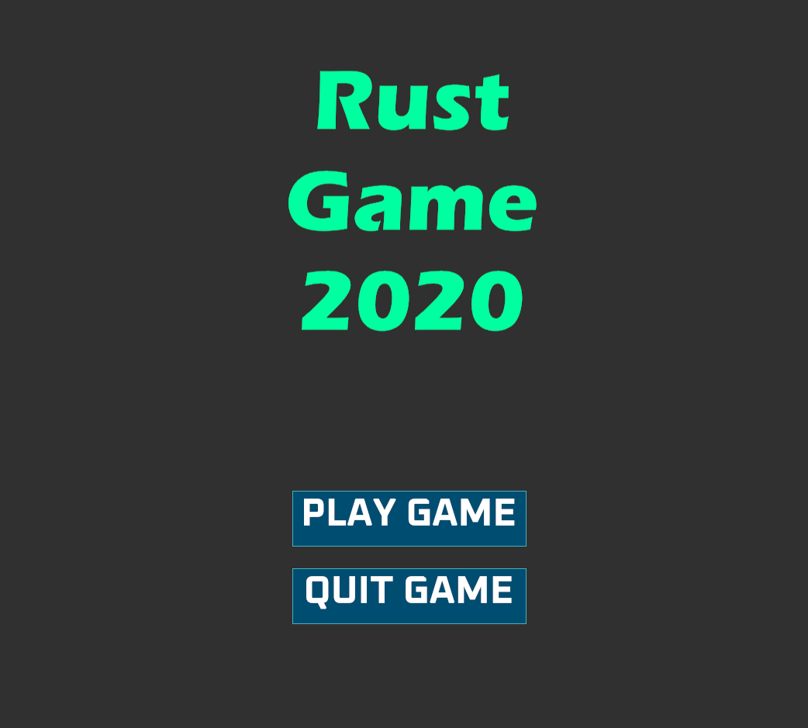
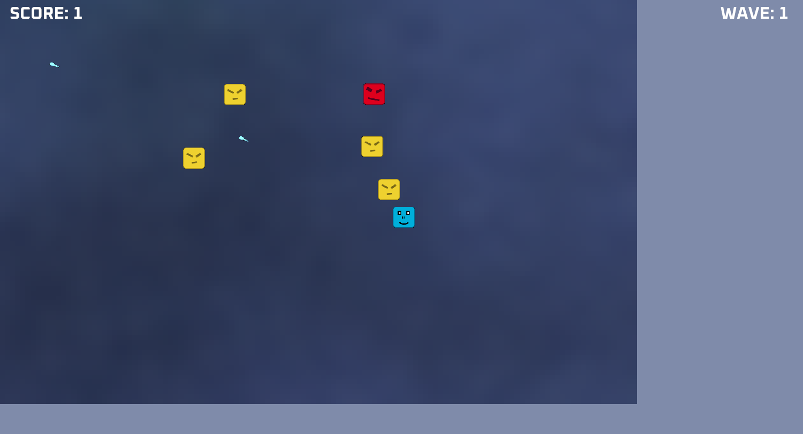
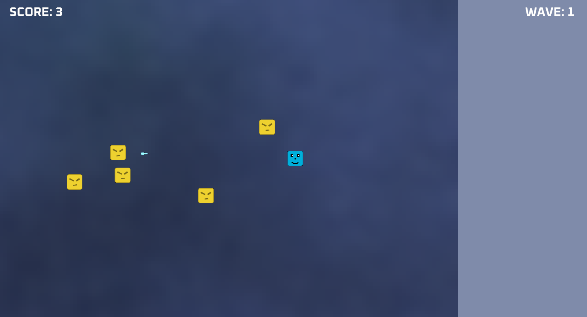
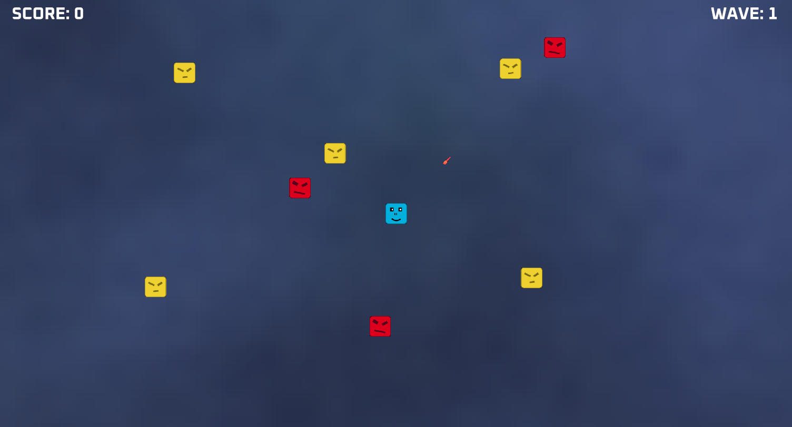
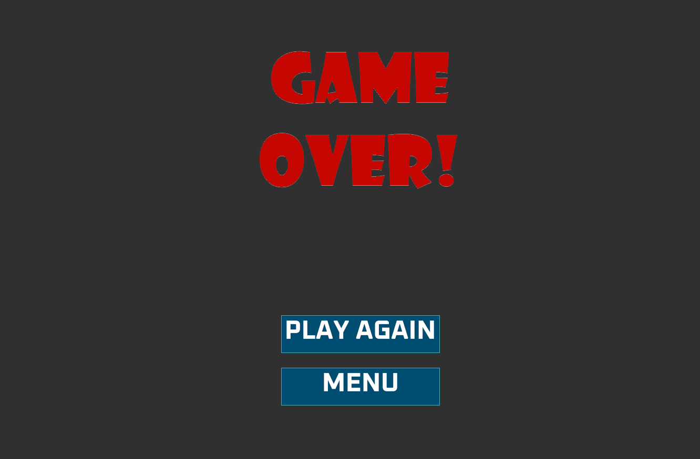

# Rust Game 2020

A simple top-down shooter game made in Rust with the Amethyst game engine.

## Screenshots

## How to play

New Version: Clone & run with: cargo run --release.

Old Version: Go to the [releases](https://github.com/Rijk-van-Putten/Rust-Game-2020/releases) to download & play the game.
